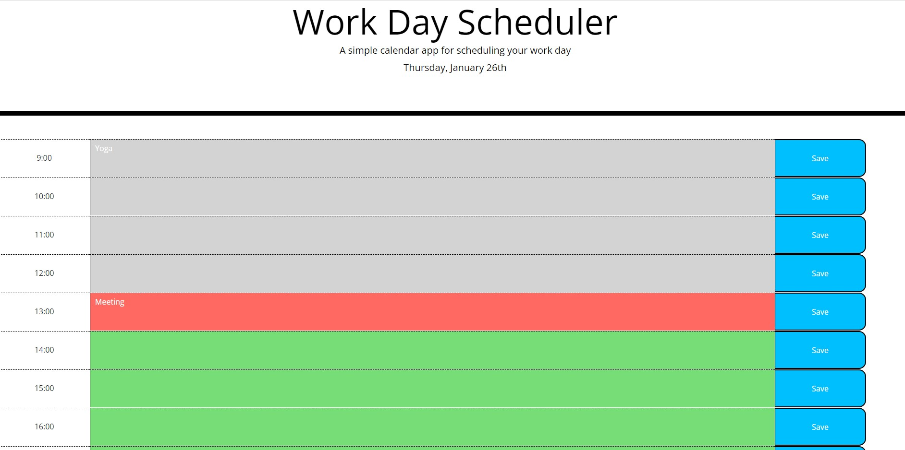

# Work Day Scheduler

## Description

This project is for users to add work tasks accordingly the day time. The time lines which are in the past will be shown in grey, the current time line will be shown in red and the future time lines will be shown in green. 

## Screenshots
 

## Links

- Solution URL: [Solution URL here](https://github.com/KodeIva/Day-Scheduler)
- Live Site URL: [Live site URL here](https://kodeiva.github.io/Day-Scheduler/)

## Technologies used

- HTML5
- CSS 
- JavaScript
- jQuery
- Bootstrap
- Moment.js

### jQuery codes

- moment()
- on()
- attr()
- append()
- for loop
- localStorage

## Installation

 N/A

## Credits

N/A

## License
[MIT](https://choosealicense.com/licenses/mit/)